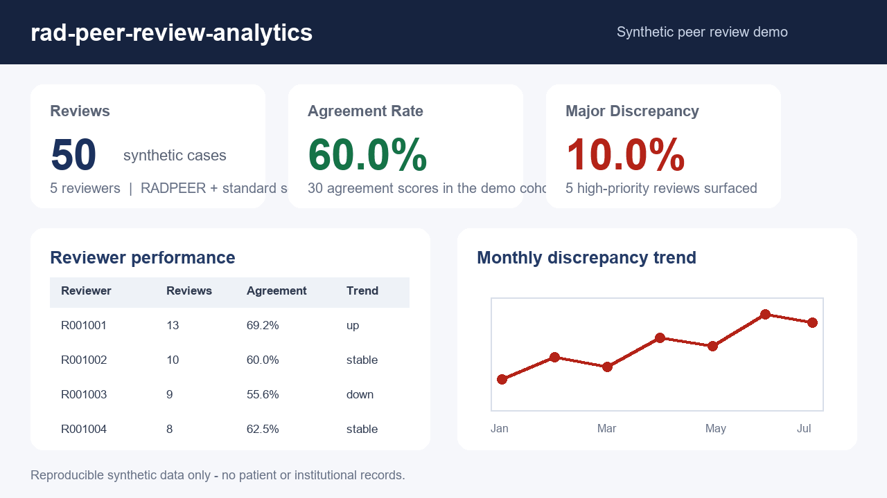

# rad-peer-review-analytics

[](https://github.com/AKaturu/rad-peer-review-analytics/actions/workflows/ci.yml)
[](https://www.python.org/)
[](LICENSE)
[](https://github.com/astral-sh/ruff)

**Radiology peer review tracking, scoring, and analytics — RADPEER and standard score systems.**

`rad-peer-review-analytics` helps radiology departments track peer review data, score discrepancies, and generate analytics reports. It supports both the RADPEER score system (1/2/3a/3b) and a standard score system (agree/minor/major/not actionable), with automatic score conversion, discrepancy classification, and trend detection.



## Evidence Status

| Evidence | Status |
|---|---|
| Unit and integration tests | Complete |
| Synthetic end-to-end evaluation | Complete |
| Public-data evaluation | Not completed |
| Independent expert review | Not completed |
| Institutional validation | Not completed |
| Prospective clinical validation | Not completed |

This software is a research prototype and is not intended for independent clinical decision-making.

## Quick Start

```bash
git clone https://github.com/AKaturu/rad-peer-review-analytics.git
cd rad-peer-review-analytics
python -m pip install -e .

# Generate and analyze demo data
rad-peer-review-analytics demo

# Import from CSV
rad-peer-review-analytics import-reviews reviews.csv

# Run the analytics report
rad-peer-review-analytics report

# Export report to CSV
rad-peer-review-analytics report --output report.csv

# Export to JSON
rad-peer-review-analytics report --json report.json

# List reviewer stats
rad-peer-review-analytics reviewers

# Show modality breakdown
rad-peer-review-analytics modalities

# Show monthly trends
rad-peer-review-analytics trends

# Export raw reviews to CSV
rad-peer-review-analytics export reviews.csv
```

## Demo Media

The README demo is generated from synthetic peer-review summary values only. To regenerate the GitHub assets:

```bash
python -m pip install -e ".[media]"
python scripts/generate_demo_media.py
```

See [docs/DEMO_MEDIA.md](docs/DEMO_MEDIA.md) for the asset policy.

## Example

```bash
rad-peer-review-analytics demo --reviewers 5 --reviews 50
```

```
Summary: 50 reviews, 5 reviewers, 30 agreements (60%), 5 major discrepancies (10%)

Peer Review Analytics Report
Period: 2024-01-22 to 2024-12-13
Reviews: 50 | Reviewers: 5

Overall Agreement Rate:    60.0%
Major Discrepancy Rate:    10.0%
Average Score:             0.775
```

## CLI Commands

| Command | Description |
|---|---|
| `demo` | Generate synthetic peer review data |
| `import-reviews <file>` | Import reviews from CSV |
| `analyze` | Generate and display analytics report |
| `report` | Generate report with optional CSV/JSON export |
| `reviewers` | List all reviewers with stats |
| `modalities` | Show modality-level statistics |
| `trends` | Show monthly trend data |
| `export <path>` | Export loaded reviews to CSV |

## Score Systems

### RADPEER

| Score | Label | Weight | Discrepant? |
|---|---|---|---|
| `1` | Agree | 1.0 | No |
| `2` | Agree with minor disagreement | 0.75 | No |
| `3a` | Disagree — not normally perceived | 0.25 | Yes |
| `3b` | Disagree — should be perceived | 0.0 | Yes |

### Standard

| Score | Label | Weight | Discrepant? |
|---|---|---|---|
| `agree` | Agree | 1.0 | No |
| `minor_discrepancy` | Minor Discrepancy | 0.5 | Yes |
| `major_discrepancy` | Major Discrepancy | 0.0 | Yes |
| `not_actionable_discrepancy` | Not Actionable Discrepancy | 0.5 | Yes |

Scores can be converted between systems with `radpeer_to_standard()` and `standard_to_radpeer()`.

## CSV Import Format

```csv
review_id,reviewer_id,reviewee_id,case_id,score,score_system,review_date,modality,body_part
R001,R001001,R001002,C001,1,radpeer,2024-06-15,CT,CHEST
R002,R001003,R001001,C002,3b,radpeer,2024-07-01,MRI,BRAIN
```

Column names are flexible — snake_case, PascalCase, and mixed formats are all accepted (e.g., `reviewer_id`, `ReviewerID`, `ReviewerId`). Dates support `%Y-%m-%d` and `%m/%d/%Y` formats.

## Analytics

The analytics engine computes:

- **Reviewer stats** — total reviews, agreement/major discrepancy rates, average score, trend direction
- **Group stats** — aggregate metrics per reviewer group
- **Modality stats** — agreement and discrepancy rates per imaging modality
- **Body part stats** — performance breakdown by anatomical region
- **Monthly trends** — agreement and discrepancy rates over time
- **Top discrepant modalities** — modalities with the most discrepancies

Trend direction is computed by comparing first-half vs. second-half agreement rates (requires 4+ reviews per reviewer):

- **Improving** — agreement rate increased by >5%
- **Declining** — agreement rate decreased by >5%
- **Stable** — change is within 5%

## Export Formats

- **CSV** — report exports separate files per section (`_reviewers.csv`, `_modalities.csv`, `_body_parts.csv`, `_trends.csv`, `_groups.csv`)
- **JSON** — full report as a single JSON file

## Architecture

1. **Models** (`models.py`) — 14 Pydantic models and 3 StrEnum types for all data entities
2. **Scoring** (`scoring.py`) — score weights/labels, discrepancy classification, RADPEER ↔ standard conversion
3. **Analytics Engine** (`analytics.py`) — computes reviewer stats, group stats, modality/body part breakdowns, monthly trends, and trend direction
4. **Importer** (`importer.py`) — CSV import with flexible column name matching and date format auto-detection
5. **Synthetic Data** (`synthetic.py`) — generates realistic demo data with weighted score distributions
6. **Exporter** (`exporter.py`) — multi-file CSV export and JSON export
7. **CLI** (`cli.py`) — Typer interface with 8 commands

## License

MIT — see [LICENSE](LICENSE).
